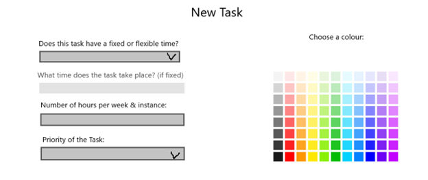
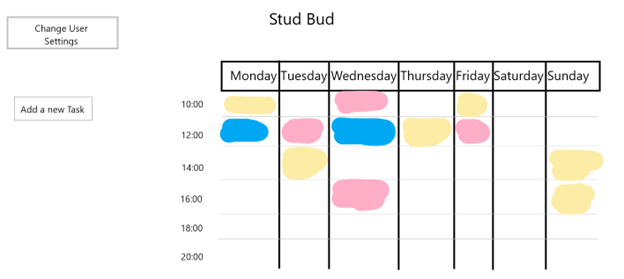
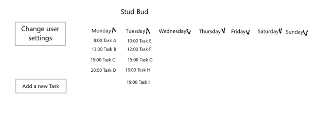

# StudBud

### Indis Inc.

#### *Helping students plan their studies.*

### Team

**Project Manager**: Nami Maleki

**Designer**: Peyton Belchetz

**Developers**: Henry La Croix, Sam Weston, Mahen Krishnakumar

### Problem Description

In engineering, managing assignments, due dates, studying, and exams, while also balancing personal life, can be a significant challenge. This often leaves students feeling overwhelmed and unmotivated even before they start planning their schedules. The lack of organization can lead to poor time management and negative academic outcomes. Unfortunately, creating an effective schedule is time-consuming, and this time could otherwise be spent studying or on other activities. How can we help students overcome this hurdle to excel academically?

### Need Statement

We need to develop a simple and intuitive way for students at UBC to plan their work and deadlines around their daily lives.

### Solution

##### Why this is necessary?

Effective student organization is key to academic success. Razali et al., [1] and many others have found a correlation between organization and success. By organizing tasks by importance and deadlines, students can focus on high-priority tasks and maintain control over their workload.

Additionally, students involved in extracurricular activities often perform better academically [2]. With better organization, students would be able to visualize and balance all their responsibilities, potentially adding extracurriculars to their routines. Organized planning also helps students break larger projects into smaller, manageable parts, reducing feelings of overwhelm and enabling a healthier work-life balance.

##### Introducing StudBud

StudBud differentiates itself from other scheduling tools by seamlessly integrating academic schedules, assignment deadlines, and test dates with personal life events. This unified platform allows students to balance both their academic and personal lives efficiently. Users can input personal events, assign priority values to tasks, and receive an optimized schedule that accommodates both academic and personal commitments.

### Technical Overview

Upon first using StudBud, users are prompted to enter:

- Class times, job hours, etc.
- Preferred work/study times
- Commute time
- Work deadlines
- Other relevant information

At any time users can add additional tasks to their schedule. Users can add new tasks by specifying:

- Fixed or flexible time
- Duration and weekly frequency
- Priority level
- Task color

StudBud offers two display modes: **Calendar View** and **List View**. The Calendar View defaults to showing tasks, class times, and commute schedules. 

**Calendar View** \

**List View** \

StudBud then allocates tasks within the calendar based on user preferences, balancing all specified requirements. Users can also edit their settings via a dedicated button.

## **Sources**

[1]          S. N. A. M. Razali, M. S. Rusiman, W. S. Gan, and N. Arbin, “The Impact of Time Management on Students’ Academic Achievement,” _J. Phys. Conf. Ser._, vol. 995, no. 1, p. 012042, Apr. 2018, doi: 10.1088/1742-6596/995/1/012042.

[2]          C. N. Baker, “Under-represented college students and extracurricular involvement: the effects of various student organizations on academic performance,” _Soc. Psychol. Educ._, vol. 11, no. 3, pp. 273–298, Aug. 2008, doi: 10.1007/s11218-007-9050-y.